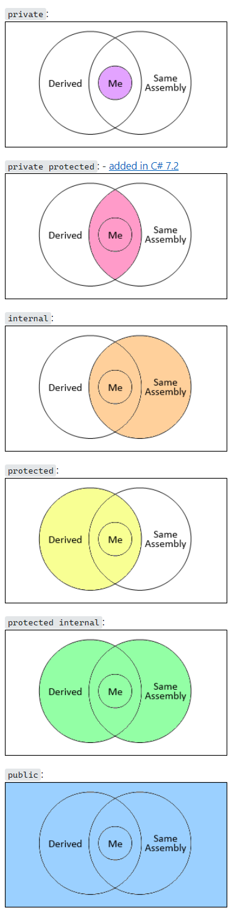

# AccessModifier

References
- [Accessibility Levels on Microsoft](https://learn.microsoft.com/en-us/dotnet/csharp/language-reference/keywords/accessibility-levels)
- [Answer from Stackoverflow](https://stackoverflow.com/questions/22856215/what-is-the-meaning-of-the-planned-private-protected-c-sharp-access-modifier/22958035#22958035)

## Declared accessibility
 <br>


## Note
1. namespace 에는 access modifier 를 사용할 수 없다. namespace 는 access 제한이 없음
1. nested type 이 아닌 top-level type 인 경우, ```internal``` 또는 ```public``` 만 사용 가능. default 는 ```internal```
